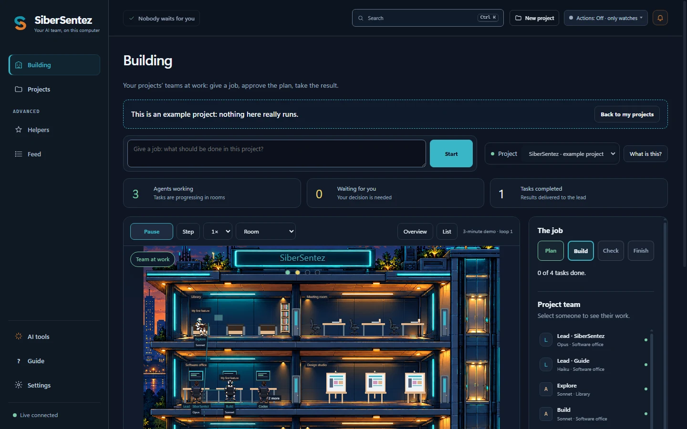
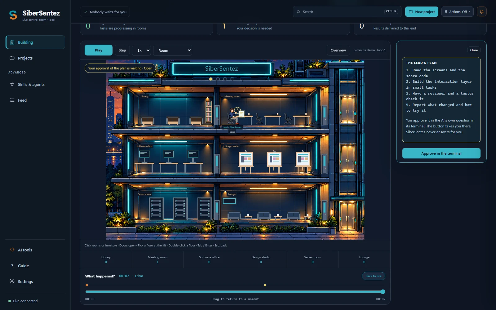
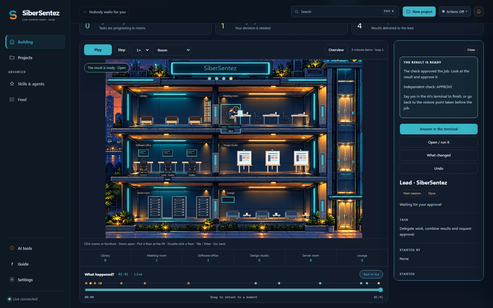
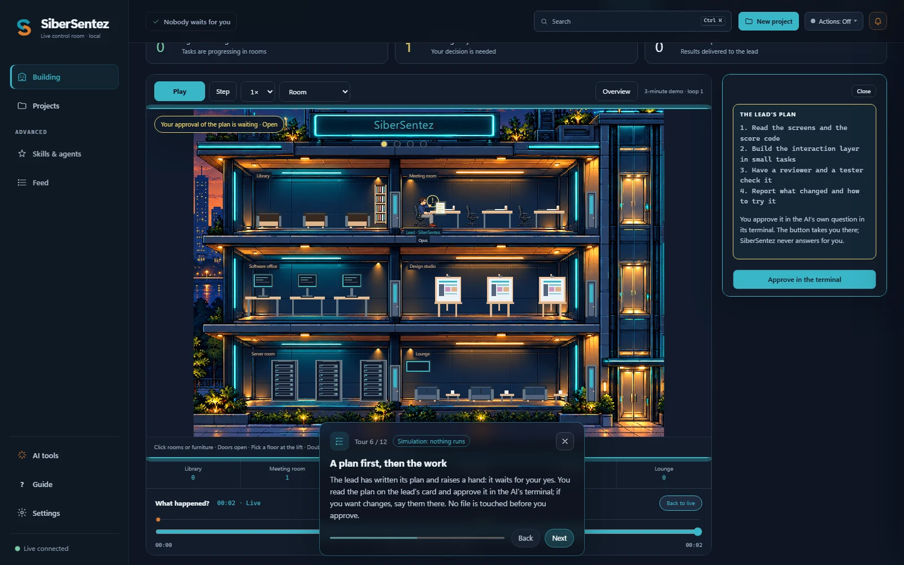
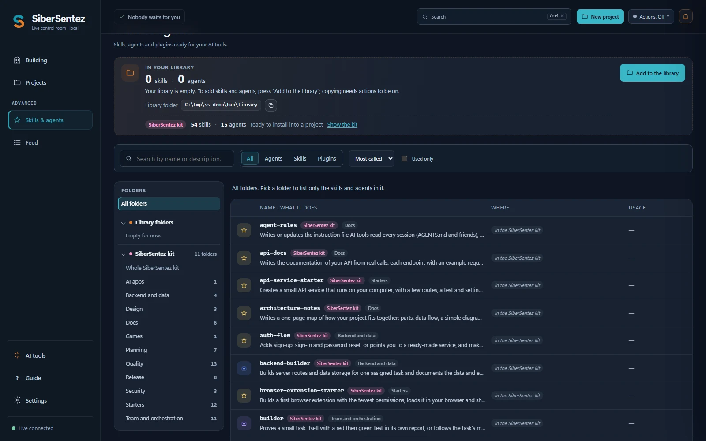

# SiberSentez — AI coding for beginners

**Build something with AI coding tools, even if you have never written code.** A free Windows desktop app that sets up,
starts and shows Claude Code, Codex CLI, Gemini CLI and other AI coding agents for people new to coding.



SiberSentez is a Windows program for beginners who want to use AI coding tools (Claude Code, Codex CLI, Gemini CLI and
others) with the subscription they already have. It does not bring its own AI and sends your work nowhere: it sets
things up so the tool you chose can help you well, and keeps you safe while it works.

- **Start from an idea.** Create a project, write in your own words what you want to make ("a to-do list", "a site for
  my restaurant"). SiberSentez picks a fitting starting point and the few skills that help, and explains why.
- **Say the job, press Start.** The **Building** screen has one box: write what you want done ("add a menu page") and
  press **Start**. SiberSentez sets up the small team and starts the AI in **its own terminal**, inside the window, with
  your job as its first message. Under the box there are examples to click ("Fix a problem", "What is the next step?",
  "Make it look better").
- **Do a job with a small team.** The AI first makes a plan (Claude Code starts in plan mode) and you approve it in the
  terminal; it builds, has it checked by a separate reviewer and asks you to approve the result. A bar shows
  Plan → Build → Check → Finish. When a job is done, **What next?** suggests the next step, and **Earlier jobs** keeps
  the finished ones.
- **Undo for every job.** Before an AI tool starts, SiberSentez keeps a copy of the project, named after your job
  ("Before “Add a menu page”"); you see what would change, then go back to it, and going back can be undone too. A big
  project's copy leaves out its big files and logs, and the job says so; if no copy could be made, it says that too.
- **See what happened.** What changed, how to run it ("Open in the browser" when the terminal prints a local address),
  and what the AI sessions are doing right now.
- **Know what needs you.** Who is waiting for you; when the AI stops on an error (usage limit, not signed in, lost
  connection) a card says what to do, and a notice tells you when a limit is open again. A small badge shows how freely
  the AI may act (plan only, asks every step, edits files itself, ...).
- **Set-up check.** It finds the AI tools on this computer and says in plain words what is missing or broken.
- **Turkish and English**, dark theme, keyboard friendly.

How it works: install → **New project** → write your idea → in the **Building**, write the job in the box and press
**Start** → approve the plan in the terminal → open or run the result → accept it or go back.

<table>
  <tr>
    <td width="50%"><br><b>A plan first.</b> The lead writes a plan and raises a hand; nothing is touched before you approve it in the AI's terminal.</td>
    <td width="50%"><br><b>The result, checked.</b> A separate reviewer checks the work; then open or run it, see what changed, or undo it.</td>
  </tr>
  <tr>
    <td width="50%"><br><b>A full tour.</b> Twelve steps on the real screen, from the AI tool to the result; a simulation, nothing runs.</td>
    <td width="50%"><br><b>Skills and agents.</b> A kit of 59 skills and 16 agents written for beginners, installed into a project only when you choose.</td>
  </tr>
</table>

- It runs only on this computer (`127.0.0.1`). It goes to the internet in **two cases only**, both your choice: when you bring skills from GitHub (only with actions **On** and only when you press **Fetch** or **Check for update**: `github.com`, `codeload.github.com` and `api.github.com`), and, if you turn on **Tell me when a new version is out** in Settings (off by default), once a day to read the list of SiberSentez's releases on `api.github.com`. Nothing is sent and nothing is downloaded by that look. Otherwise it sends nothing anywhere (see [Privacy and security](#privacy-and-security)).
- It is **read-only by default**: while actions are Off (the default) it reads logs, projects and settings and changes none of them. The only files it writes then are its own settings and logs and, in the hub folder, the skeleton on first start, its project memory (`registry\discovered.json`), its usage ledger (`usage\ledger.json`), the last new-version answer (`update-check.json`, only when that look is turned on) and, when you change it (header indicator, window menu or tray menu), the actions mode in `settings.json`; it also deletes its own GitHub downloads in `incoming\` once they are seven days old. With actions **On**, the skill flow also copies into the hub library, keeps `registry\installs.json` and a `trials\` folder, and installs into or removes from the project folders you choose (see [Skills](#skills)); a GitHub import downloads into `incoming\` and records where each item came from in `registry\sources.json`; **Start with AI** writes a small start file into `launch\`, a restore point of the project into `restore\` in the hub and, when you start with your idea or a job, `.sibersentez\` into the project. In **Preview** it only shows what it would do.
- It is **free and open source**: the app is under the GNU GPL version 3 or later, its kit of skills and agents under the MIT License (see [License](#license)).
- It comes with **its own small kit of skills and agents** (59 skills, 16 agents, written for SiberSentez; see [Skills](#skills)) and is **not tied to any AI service**. Nothing is active until you install it into a project; the tools you already set up in your own projects are found and shown too.

## Requirements

- Windows 10 or Windows 11 (64-bit).
- Optional: an AI coding tool. Live sessions and token usage are read from Claude Code. Projects, skills, agents and plugins are found for Claude Code, Codex, Gemini CLI, GitHub Copilot (CLI and VS Code Chat), Cursor and Antigravity (see [Roster sources](#roster-sources)). **Start with AI** starts Claude Code, Codex CLI, Gemini CLI, GitHub Copilot CLI, Cursor CLI, Qwen Code or OpenCode. Without any of them the program still opens; there is simply nothing to show.
- Optional: git, for GitHub downloads. Without it SiberSentez downloads the repository as an archive.

You do not need to install Node.js or anything else to use the program.

## Installation

1. Download `SiberSentez-Setup-<version>.exe` from the project's **Releases** page.
2. Run it. SiberSentez installs into `%LOCALAPPDATA%\Programs\SiberSentez`, for the current user only, and **does not ask for administrator rights**.
3. When setup finishes you have a **SiberSentez** shortcut on the Desktop and in the Start menu. Open SiberSentez.

> **"Windows protected your PC" warning:** the installer is not code-signed yet, so Windows SmartScreen may warn you the first time.
> If you downloaded the file from the project's own page, click **More info**, then **Run anyway**.

On first start SiberSentez creates an **empty hub folder** (see below) and scans the last 14 days of Claude Code logs; this can take a few seconds.

### Everyday use

- Closing the window keeps SiberSentez running in the **system tray**; click the tray icon to open the panel again.
- Tray menu: **Open**, **New project…** (see [Start a project](#start-a-project)), **Open hub folder**, **Actions** (see below), **Start at login** (start in the background when you sign in to Windows), **Quit**. Windows 11 hides new tray icons: click the **^** arrow next to the clock to find it, or drag it onto the taskbar to keep it visible. While the panel is still getting ready (starting, or restarting after a change), **New project…** says so in a tray balloon ("SiberSentez is getting ready. Try again in a few seconds.") instead of doing nothing.
- Only one instance runs: starting it again brings the existing window to the front.
- The program serves its panel on a free port of its own in the 47700-47799 range, never on 4545, so it does not clash with a separately running SiberSentez panel (for example one started from source) or any other program.

### Actions

The panel can also act: give a job (the **Start** button of the Building) or start an AI tool in a project folder ([Start with AI](#start-with-ai)), open a terminal there, resume a Claude Code session or open a copy of it, open a folder in Explorer or in VS Code, install skills into a project and bring skills from GitHub ([Bring skills from GitHub](#bring-skills-from-github)). Actions are **off** after installation. In the desktop app you do not have to hunt for the switch: the first **Start** asks once, in the drawer, "Turn actions on?" with what On means for this job; the answer **Turn actions on and start** turns them on and starts the job.

**The Actions panel.** Click the **Actions** indicator at the top of the window (mouse, Enter or Space). A small panel opens right under it, inside the window, with three choices and one plain line each; the stored mode is marked *current*:

- **Off**: "SiberSentez only watches and runs no action (it still spots installed AI tools)." The menu only copies paths and opens details.
- **Preview**: "Shows what each action would do, and runs nothing." An action shows the command it would run.
- **On**: "Actions really happen: opening terminals, installing skills and the like."

Off and Preview apply at once. **On** asks first, in the panel itself: what On does, then **Turn on** / **Cancel** (Cancel first and focused). The panel then says "Saving…", then "Saved"; the panel's server restarts with the new mode and the window reloads by itself, keeping the tab and the open drawer. A change that fails (the settings file is invalid or cannot be written, no hub) is shown in the panel and the mode stays as it was. The drawer's **Change actions** button opens the same panel. The panel works with the keyboard (arrow keys move, Enter or Space applies, Esc closes) and with screen readers.

The same three choices are in the **window menu** (press **Alt**) → **Actions** and in the **tray menu** → **Actions**. Choosing On there brings the window up and asks in its panel; only when no window can ask does a small confirmation dialog appear.

The choice is stored as `"actions"` in the hub's `settings.json` and survives restarts. Within SiberSentez only the program itself changes it: the panel reaches the program through a bridge that exists only in the program's own window (see [Privacy and security](#privacy-and-security)), so a web page open in your browser can read the mode but never change it, and the `SIBERSENTEZ_ACTIONS` environment variable has no effect on the installed program. The panel's header shows the current mode.

The confirmation guards against switching actions on by accident; it is not a security boundary. Any program running under your Windows account can edit `settings.json`, or start SiberSentez with `SIBERSENTEZ_HUB` pointing at another hub folder. Each time the panel's server starts (also when it is restarted after a crash), the tray menu and the window menu show the stored mode again, and when SiberSentez finds actions on without having switched them on itself, it warns, in the tray and in a dialog, once for each such change.

### Right-click menu

| On | Items (Preview and On) |
|---|---|
| A project | **Start with *tool*** for each AI tool found on this computer (see [Start with AI](#start-with-ai); while the tools are being looked for, or none is found, one item **Start with AI…** opens the project drawer at that section), **Open terminal** (a plain terminal in the project folder, by default in SiberSentez's own terminal inside the window; **Open in Windows Terminal** is the second item, and Windows PowerShell is used when Windows Terminal is missing; no AI command is typed for you, you start `claude`, `codex`, `gemini`, … yourself), **Resume Claude Code session** (or **Open a copy of the Claude Code session** while that session is open) when the project has one, **Open folder** (Explorer), **Open in VS Code**, **Matching skills…** |
| A session | **Resume Claude Code session** (or a copy while it is open), **Start with *tool*** in the session's folder, **Open a terminal in this folder**, **Open folder** |
| An agent | Resume, or open a copy of, its parent Claude Code session |
| A library item | **Install into project…** |

In Off the menu only copies paths and ids and opens details. In Preview each item shows its command and runs nothing; in On it runs. The folder and every argument come from SiberSentez's own records, never from the page; broad folders (your user folder, a whole drive, `C:\Windows\System32`) get no action.

## Start a project

For a new project there is one path, from an empty folder to an AI tool at work in it:

1. **New project**: the button in the header, the **Getting started** card in the Projects tab (shown while you have two or fewer projects of your own), **New project…** in the tray or **New project** in the command palette (`Ctrl+K`).
2. **Choose or create the folder** in the system folder picker (it has **New folder**). Some folders cannot be projects and are refused with the reason: a network or WSL folder, a whole drive, your user folder, Desktop / Documents / Downloads themselves, the Windows, Program Files and ProgramData folders and everything in them, the OneDrive folders themselves (a project folder inside OneDrive is fine), the hub folder, anything inside it or holding it, the program folder, Claude Code's own settings folder, a link, a folder that holds listed projects. A folder that is already listed opens that project.
3. **Write your idea**: the project's drawer opens at *Skills that fit this project* with the cursor in the idea box ("What do you want to build in this project?", for example "a 2D platform game in Unity"). SiberSentez reads the idea and the folder on this computer (nothing is sent to an AI) and ticks the skills and agents that fit.
4. **Look at the suggestions**: each with its reason in plain words ("your idea mentions “Unity”", "Unity project", "installed in Demo").
5. **Install** them if you want (actions On; in Preview the button only lists what would be installed). You do not have to: **Start** sets up the team and the helpers that fit your job by itself.
6. **Give the first job.** In the **Building** screen write what you want done in the box (or click **Start with my idea**, an example under the box that appears while the project has an idea but no job yet) and press **Start**. The AI opens in SiberSentez's own terminal in the project folder, in plan mode, with your job as its first message; you approve its plan in the terminal. The drawer's **Start with *tool*** buttons and **Plain terminal** are still there under *Details*. See [Start with AI](#start-with-ai).

The project is remembered in the program's own project memory, `registry\discovered.json` in the hub, never in your `registry\projects.json`; the idea is kept with it. Adding a project works in every actions mode, because it only writes SiberSentez's own record. In a browser the button explains that new projects are added in the SiberSentez app.

## Do a job

The **Building** is the main screen (menu: **Building**, **Projects**, and under a small *Advanced* label **Skills & agents** and **Feed**; AI tools, Guide and Settings at the foot). Three decisions are yours, all in the Building: give the job, approve the plan, accept or undo the result (details: [docs/simplify.md](docs/simplify.md), [docs/kit-in-app.md](docs/kit-in-app.md)).

- **Give the job.** Write it in the box at the top (at most 300 characters; the project it goes to is chosen beside it) and press **Start**; the command palette (`Ctrl+K`) has **Give a job** too. Under the box there are examples that only fill it ("Fix a problem", "What is the next step?", "Make it look better"; first, while the project has an idea but no job yet, "Start with my idea"). With actions Off, **Start** asks once to turn them on (see [Actions](#actions)). With no AI tool installed it says so and opens the AI tools panel.
- **What Start does.** In one go it takes a restore point (see below), sets up the team and the helpers the server chose for your words, and starts Claude Code in plan mode (another tool starts as usual) in SiberSentez's own terminal, with your job as its first message.
- **Approve the plan.** The Building shows the plan; **Approve** takes you to the AI's own plan prompt in the terminal. SiberSentez never answers the AI's question for you.
- **Follow the job.** A bar shows Plan → Build → Check → Finish with one plain sentence on where the job stands ("working on T2, 1 of 3 tasks done"). A separate reviewer checks the work before you accept it. If you close the terminal tab, the box says where the job stopped and offers **Go on where it stopped**.
- **Open or run the result.** The result card has **Open / run it**, **What changed** and **Undo**. **How to run it** says in numbered steps how to start what was built (copy buttons; in the desktop app **Type in terminal** writes the command for you, you press Enter). For a plain web page there is **Open in the browser**; when a dev server prints a local address in the terminal (for example `localhost:5173`), **Open in the browser** also appears at the terminal's bottom right. SiberSentez runs none of these commands itself.
- **Accept it and go on.** A finished job shows **What next?** ("Change something"; for a web project also "Try it like a user" and "Put it online"; each only fills the job box), and finished jobs are kept under **Earlier jobs**.
- **Go back.** Before each start SiberSentez copies the project's files into the hub (`restore\`; at most five points, up to 3,000 files and 50 MB; over that a lean copy without files over 2 MB and logs, up to 6,000 files and 150 MB; git folders, `node_modules` and build output are always left out). The start notice says whether the copy is full, lean (and how many files it left out) or could not be made; the job box says it next to that job, after a reload too (the restore points in the project drawer list every copy). A point is named after the job ("Before “Add a menu page”"). **Undo** shows what would change and goes back; going back takes a new point first, so it can be undone too (details: [docs/restore.md](docs/restore.md)).

**What needs you** (details: [docs/attention.md](docs/attention.md)): the header counts the sessions waiting for you and says what each asks for ("approval of its plan", "an answer to its question"). When Claude Code stops on an error, a card in the Building, the drawers and the notices says what happened and what to do: usage limit (type `go on` when it opens again, with the time), not signed in (`/login`), lost connection, conversation too long (`/compact`). When a limit opens again a notice tells you. A small badge on a session shows how freely the AI acts: *Plan only*, *Asks every step*, *Only what is allowed*, *Edits files itself*, *Automatic*, *Asks nothing*. SiberSentez only shows it; it never changes the mode.

## Start with AI

SiberSentez finds the AI coding tools on this computer, shows whether each one is ready, and starts one in the project folder, with your idea or your job as its first message (details: [docs/ai-start.md](docs/ai-start.md), [docs/embedded-terminal.md](docs/embedded-terminal.md), [docs/simplify.md](docs/simplify.md)). The **Start** of the Building uses the tool chosen in Settings (**AI tool**), else Claude Code, else the first one found. The AI opens in **SiberSentez's own terminal**, a dock at the bottom of the window with one tab per terminal; Windows Terminal is the second choice.

| Tool | Command looked for | Signed in? |
|---|---|---|
| Claude Code | `claude` | checked (`claude auth status`) |
| Codex CLI | `codex` | checked (`codex login status`) |
| Gemini CLI | `gemini` | not known |
| GitHub Copilot CLI | `copilot` | not known |
| Cursor CLI | `cursor-agent`, then `agent` | not known |
| Qwen Code | `qwen` | not known |
| OpenCode | `opencode` | not known |

- **Where:** mostly the **Start** button of the **Building** (a job: see [Do a job](#do-a-job)). Also in the project drawer, folded under *Details*: one **Start with *tool*** button per tool found, **Start with my idea (first message ready)** when the project has a saved idea (on by default, remembered per project in this browser), **Plain terminal**, and the links **AI tools on this computer** and **Check again**. The right-click menu of a project or a session has the same **Start with *tool*** items (see [Right-click menu](#right-click-menu)); the **Getting started** card has an **AI tools** button.
- **Finding the tools** happens only when first needed (a project drawer, the tools panel, a project or session menu), never when SiberSentez starts, and the answer is kept for five minutes (**Check again** asks anew, at most once in ten seconds). A tool is found by looking for its file (`.exe`, `.bat`, `.cmd`) in the folders of `PATH` and in the folders the official installers use (`%USERPROFILE%\.local\bin`, `%APPDATA%\npm`, `%LOCALAPPDATA%\Microsoft\WinGet\Links`, `%USERPROFILE%\scoop\shims`), so a tool installed while SiberSentez runs is found too. Only the tools found this way are run, hidden and with a time limit: for their version and, for Claude Code and Codex, the sign-in check, of which only the exit code is kept (its output, which names your account, is not even read). No path, file name or user name reaches the page. Tools whose sign-in cannot be checked show "Sign-in not known: it asks the first time if needed".
- **Starting:** in **Preview** the button shows the command and starts nothing; with actions **On** the tool opens in a new tab of SiberSentez's own terminal in the project folder, named after the project (in the desktop app; **Open in Windows Terminal** or, when the dock is full or missing, a Windows Terminal tab; a Command Prompt window when Windows Terminal is missing or does not start). The tool starts interactively: a one-shot mode (`-p`, `exec`) is never used and no permission, "yolo" or bypass option is ever added; the only mode flag is that a **job** starts Claude Code in plan mode (`--permission-mode plan`), so you approve the plan first. After the tool ends, the shell stays open in the project folder. Closing a running AI's tab asks once (a second click stops it), and an AI that stopped half-way offers **Go on where it stopped**.
- **The first message** (actions On, with your idea): SiberSentez writes `.sibersentez\ilk-mesaj.md` into the project: your idea and plain instructions (work out a plan with me step by step, one question at a time, write `PLAN.md` at the end, use the `idea-to-plan` skill if it is installed, talk in the idea's language), plus `.sibersentez\.gitignore` (`*`, only when there is none), and starts the tool with one fixed sentence: *Please read .sibersentez/ilk-mesaj.md and follow it. Reply in the user's language.* Nothing is ever overwritten: a file with the same text is used as it is, a file you changed stays and the new message goes to the next free name (`ilk-mesaj-2.md` … `ilk-mesaj-9.md`); a `.sibersentez` that is a file or a link blocks the start. Without the idea nothing is written into the project.
- **The start file:** Windows Terminal never receives the tool's path or your idea. SiberSentez writes a small ASCII start file, `launch\<12 hex>.cmd` in the hub (or in `%LOCALAPPDATA%\SiberSentez\launch`: without a hub, or when only that folder's path can go on the terminal's command line as it is), and the terminal only runs `cmd.exe` with it. Start files older than 24 hours are removed at the next start.
- **The tools panel** (**AI tools on this computer**): the installed tools first, with version, how each was installed and whether it is signed in (and a note when a tool is installed twice); then the other tools with their official install command and a **Copy** button, the account each needs, the Node.js 20 note for npm commands and a tip for when PowerShell refuses to run scripts. **SiberSentez never runs these commands**: you copy one and run it yourself, then press **Check again**. The first time a tool opens in a folder, it asks whether you trust the folder and asks you to sign in; answer in the terminal.
- **Check by hand** (not covered by the automated tests, see [docs/ai-start.md](docs/ai-start.md#check-by-hand-not-covered-by-automated-tests)): a real start of Claude Code and of Gemini CLI in the terminal with the first message, the trust and sign-in questions on a first run, the shell staying open after the tool ends, the Windows Terminal and Command Prompt fallbacks, a user folder with a space or a Turkish letter, an edited first message, a tool installed while SiberSentez runs.
- **Limits:** when your user folder has a space or a letter outside English, the start file changes into the project folder itself, so a project folder whose name is not plain ASCII (for example `D:\Oyun Çalışması`) cannot be started in Windows Terminal that way (SiberSentez's own terminal and the plain terminal have no such limit). Cursor CLI is also looked for under its generic name `agent`, so another program with that name would be taken for it (only its version is asked, hidden).

## Where things live

| What | Where (default) | On uninstall |
|---|---|---|
| Program files | `%LOCALAPPDATA%\Programs\SiberSentez` | Removed |
| The SiberSentez kit (read-only) | `%LOCALAPPDATA%\Programs\SiberSentez\resources\kit` | Removed (items you installed into projects stay) |
| The program's own settings and logs | `%APPDATA%\SiberSentez` | Kept |
| **Hub folder** (your data) | `%USERPROFILE%\SiberSentez` | **Kept** |
| Start files of **Start with AI** when the hub's `launch\` cannot be used | `%LOCALAPPDATA%\SiberSentez\launch` | Kept (each file is removed 24 hours after it was written, at the next start) |
| The first message of **Start with AI** (when you start with your idea or a job) | `.sibersentez\` in the project folder (`ilk-mesaj.md`, `.gitignore`; the team's plan files and `archive\` of earlier jobs are written there by the AI tool) | Kept (it belongs to the project) |

The hub skeleton is created on first start; no existing file is ever overwritten. While it runs, the program also keeps two files of its own there, `registry\discovered.json` and `usage\ledger.json`:

```
SiberSentez\
  settings.json              hub settings (also "actions": off | dry | live, written only by the program)
  registry\projects.json     your permanent project registry (empty at first)
  registry\discovered.json   the program's project memory: projects seen by any AI tool, and the ones you added
                             with New project ("via": ["sibersentez"]), each with its "idea" when you wrote one;
                             remembered so a project stays listed after a tool deletes its logs (written by the
                             program, never edit it by hand)
  usage\ledger.json          the usage ledger: tokens per hour, project and model (older hours per day), so the
                             numbers survive restarts and the deletion of old logs (written in every actions mode;
                             a broken file is kept as ledger.json.broken and rebuilt from the logs)
  library\catalog.json       index of your skill library (empty at first; rewritten after an import)
  library\README.md          what the library is
  registry\installs.json     what SiberSentez installed into which project (after the first install)
  registry\sources.json      where each library item brought from GitHub came from: repository, branch or tag,
                             commit, folder, license, review, dates (after the first GitHub import)
  trials\                    session-only trial folders (removed after 7 days)
  incoming\                  GitHub downloads waiting to be added to the library (deleted after adding or
                             cancelling, at the latest after 7 days)
  launch\                    start files of Start with AI (each removed after 24 hours)
  restore\                   restore points: a copy of a project's files taken before each start (five per project)
```

- **Project registry:** every folder on a local drive where you used a supported AI tool shows up automatically as an unregistered project and is remembered in `registry\discovered.json`; so does a folder you add with **New project** (marked `"via": ["sibersentez"]`, with your `"idea"`, at most 300 characters, never logged). A folder that no longer exists stays listed as missing. Projects you add to `registry\projects.json` become registered; their name, description, stage and rules are shown.
- **Library:** your own archive of skills and agents. A library item is not active in any project until it is installed into one. Layout: `library\<category>\skills\<name>\SKILL.md` and `library\<category>\agents\<name>.md`. When the library is empty the panel says so; the skills and agents found in the other sources are still listed.

## Skills

Skills and agents come from three places: the **SiberSentez kit** that comes with the program, **your library** in the hub, and **your other projects**. SiberSentez picks the fitting ones for a project by itself, lets you try them without installing, installs them into the project and removes them again (details: [docs/auto-skills.md](docs/auto-skills.md), [docs/skills-flow.md](docs/skills-flow.md), [docs/kit.md](docs/kit.md)). The lists are shown whatever the actions mode; installing and trying need actions in Preview or On, and in Preview every step only shows its plan and writes nothing.

- **The SiberSentez kit** (*SiberSentez seti*): 59 skills and 16 agents written for SiberSentez, covering idea → setup → build → ship: the team that does a job (`orchestrate`, with the `planner`, `builder`, `reviewer`, `tester` and `debugger` agents and others), planning (`idea-to-plan`, `task-breakdown`), starters (`project-setup` and web, mobile, desktop, Unity and Python bot starters), quality (`test-first`, `review-changes`, `debug-helper`), trying and shipping (`try-it-in-browser`, `deploy-web`, `launch-checklist`, `domain-email`, `move-to-new-host`, `release-prep`), `security-check`, `docs-writer` and `explain-codebase`. Skills follow the Agent Skills format, agents the Claude Code subagent format, so any AI tool that reads them can use them; they talk to you in your language. The kit is a read-only folder next to the program (`resources\kit` in the program folder), is updated with the program and is **not counted in your library** (the Roster shows it as a source of its own, "SiberSentez seti: 59 skills · 16 agents, ready to install into a project"). A kit item installs straight from the kit, never through the library, and every installed copy carries its license notice (`LICENSE.md` in a skill folder, two comment lines at the top of an agent). The kit's license: `kit/LICENSE.md`.
- **The idea box** (*What do you want to build in this project?*): in the project drawer, above the list. Type what you want to build ("a 2D platform game in Unity", "an online store with Next.js", "a Telegram bot in Python", in English or Turkish); SiberSentez reads the tools and topics it names, locally and without any AI, and ticks the skills that fit, each with "your idea mentions “…”" as a reason. An empty folder gets `idea-to-plan` and `project-setup` from the kit even without an idea. In the SiberSentez app the idea is kept with the project (`registry\discovered.json`); in a browser only in that browser.
- **Skills for this project** (top of the project drawer): the project's tags (Unity, C#, Next.js, testing, ...: read from its files) and the skills and agents that fit it, from the kit and the library (one row per name: library first, then the kit), each with its reason (for example *Unity project · installed in Demo*). At most five fits are shown first, the strong ones checked for you (at most 4 skills and 1 agent); the rest wait behind **Show more**, and items found only in your other projects behind **Also from my other projects** (they are never checked unseen); items already in the project or active everywhere are folded, and items made for other kinds of projects (a React Native skill for a Unity project) are left out and only counted. In Preview the button is **Show what would be installed**: it lists the plan, copies nothing and says so in a banner with a **Change actions** button. With actions Off the button reads **Turn actions on and install**: one question says what On does and what is installed, then both happen. With actions On it is **Install the selected**: after a confirmation, items found only in other projects are added to the library first, then everything is installed, and one line says what happened ("8 skills installed, 0 skipped"). **Try** starts a Claude Code session with the selected library items from a session-only folder (`trials\` in the hub, removed after 7 days) without installing anything.
- **Project list:** a card shows a small **N fit** badge while strong fits are not installed yet; fits are asked only for the cards on screen, one at a time, and kept for five minutes.
- **Add to the library** (Roster tab, *Add to the library (does not install into a project)*) has two tabs: **From my computer** (below) and **From GitHub** (see [Bring skills from GitHub](#bring-skills-from-github)). From my computer: enter a folder, **Scan** lists the skills (folders with `SKILL.md`) and agents (`.md` files in an `agents` folder) in it with a proposed category, and whether each is new, already in the library or a different version of a library item. **Add to the library** copies the chosen ones into `library\<category>\...` and rewrites `library\catalog.json`; it installs nothing into a project. The library folders are the source of truth: a skill you drop into them by hand is listed without the catalog. Items over 20 MB or 500 files and names outside `A-Z a-z 0-9 . _ -` are refused; links (junctions) are never followed.
- **Right-click menu:** while actions are on, a project has **Matching skills…**, which opens *Skills for this project*, and a library item has **Install into project…**, which opens the drawer section below.
- **Install into a project** (roster drawer of a library item): choose the project (nothing is preselected; registered projects come first) and where it goes, `.claude` (Claude Code; also read by Copilot and Cursor) and/or `.agents` (the shared folder of Codex, Gemini CLI, Antigravity and others; skills only). **Remove** appears where the item is installed.

Rules: SiberSentez never overwrites an item it did not install (it belongs to the project), never overwrites or deletes an item changed since it was installed, and removes only what it installed. What it installed is recorded in `registry\installs.json` in the hub (with a SHA-256 of each installed tree); installing writes nothing else into a project (the only other thing SiberSentez ever writes there is the first message of [Start with AI](#start-with-ai), `.sibersentez\`). A hub in the old layout (`kutuphane\`, `registry\projeler.json`) is read but never written.

## Bring skills from GitHub

**Roster → Add to the library → From GitHub.** Paste the link of a public GitHub repository that shares skills or agents, look at what it holds, add what you choose to your library and install it into a project (details: [docs/github-import.md](docs/github-import.md)). Nothing from the repository is ever run.

1. **Paste a link** and press **Fetch**: `https://github.com/<owner>/<repo>`, also with `/tree/<branch or tag>/<folder>` or `/blob/<branch or tag>/<file>` (the file's folder is read). Other addresses are refused before anything happens: other sites (also `gist.github.com` and `raw.githubusercontent.com`), a link with a user name or password, SSH and `git@` addresses.
2. **Look and choose.** Every skill (a folder with `SKILL.md`) and agent in the download is asked three questions, and the answers are shown per item:
   - **Is it safe?** **Safe**, **Check first** or **Dangerous**, with the reasons and the file and line of each (hover). Dangerous means, for example, a program file, turning off the AI tool's permission checks, running a downloaded script straight away, a hidden (encoded) command, deleting a whole drive or the home folder, or text that tells the AI to ignore its instructions or hide things from you; *Check first* means scripts, network use, something that looks like a key, a broad shell grant or folder deletes. A dangerous item cannot be ticked and is refused on import too. Warnings about a risk ("never run …") in a document weigh less than the risk itself.
   - **What is its license?** From the item's frontmatter, a license file in its folder, else the repository's. A known license is named (MIT, Apache-2.0, GPL-3.0, CC-BY-4.0, …) with one plain sentence on what it allows; the owner's own terms, an unknown text and *No license: for personal use only; do not share it* are said as such. A missing license does not block the import: the library is yours.
   - **Which of your projects does it fit?** The same scoring as *Skills for this project*, with each project's files and saved idea: *very good fit* or *good fit*.

   Items that are safe, new to your library and fit a project come ticked; the ones that fit no project wait behind **Show the ones that fit no project too**. An item your library holds in another version needs **replace** ticked; nothing is overwritten silently. Items of the same name in the SiberSentez kit or in a project are pointed out.
3. **Add to the library** ("Add the selected to the library", at most 25 at a time) copies the ticked items into `library\<category>\...` under the usual rules (at most 20 MB and 500 files per item, links never followed) and records where each came from; **Cancel (delete the download)** adds nothing.
4. **Install into a project**: one button per project the added items fit, which installs them with the project's usual targets (the same install as in [Skills](#skills), and **Remove** works as there).

**Where it came from.** `registry\sources.json` in the hub keeps, per item, the repository, branch or tag, commit, folder, license and review. The Roster row of such an item reads "Source: owner/repo @ abc1234 · MIT", and so does a line on the item's drawer page.

**Updates, only when you ask.** Under the tab, **Brought from GitHub** lists these items with **Check for update**. A check asks GitHub for the latest commit of the item's repository and branch: the same commit is *Up to date* and nothing is downloaded; a newer one is downloaded and the item's files are compared with your library copy (added, removed, changed). **Apply the update** replaces the library copy; when you changed the copy yourself since it was added, a warning says that your changes will be replaced. There is no automatic check.

**The network.** A request goes out only with actions **On** and only when you press **Fetch** or **Check for update**. In **Preview**, Fetch only shows what it would do (repository, branch, folder, download method, the hosts it would contact, where the download would go); with actions **Off**, the tab says how to turn them on. SiberSentez contacts only `https://github.com`, `https://codeload.github.com` and `https://api.github.com`; a redirect is followed at most three times and only to these hosts. No password or token is asked for, stored or sent, and nothing about you, the computer or your projects is sent (the user agent is `SiberSentez`).

**The download.** With git on the computer: a shallow copy of one branch (`git clone --depth 1`) with credential helpers, hooks, submodules, Git LFS and symbolic links switched off and no prompt; git's own `.git` folder is deleted afterwards. Without git (or when git fails for another reason): the `tar.gz` archive, unpacked by SiberSentez itself; a path that leaves the folder refuses the whole archive, names Windows cannot hold are skipped, links and devices are never created. The download waits in `incoming\` in the hub and is deleted after adding or cancelling, at the latest after seven days. Limits: 200 MB packed, 500 MB unpacked, 50,000 files, 100 MB per file; a repository with more than 500 items lists the first 500.

**Limits.** Public repositories only: a private repository answers as "not public (or does not exist)". A branch whose name contains `/` cannot be named in a link (`/tree/a/b` is read as branch `a`, folder `b`). The archive download (without git) does not go through a proxy server. Without git, **Check for update** asks GitHub's API, which limits requests without an account per hour; past the limit the check answers "Try again later".

## Usage and cost

SiberSentez counts the tokens of every AI response in the logs of Claude Code, Codex, Gemini CLI, Qwen Code, GitHub Copilot CLI and OpenCode and shows them per period, per project and per model, with what they would cost at Anthropic API prices for Anthropic's models (details: [docs/usage.md](docs/usage.md)). Other models' tokens are shown without a dollar amount, never with a made-up price; Cursor's session logs carry no token counts.

- **Periods:** **24 hours**, **7 days**, **This month** (from local midnight of the 1st) and **30 days**. The rolling periods move by whole hours: "24 hours" is the current hour and the 23 before it.
- **Four numbers:**
  - **Processed tokens**: new input + cache writes + output, what the model worked through.
  - **Read from cache**: input the model read back from the prompt cache, with its share of all input ("98% of all input came from the cache"). It costs about a tenth of new input, so it is shown on its own and not added to the processed tokens.
  - **Output**: what the model wrote.
  - **~$ API equivalent (estimate)**: what this usage would cost at Anthropic API prices. **It is an estimate and is not billed on a subscription**: with a Claude plan you pay the plan, not this amount. Every dollar amount starts with `~$`. Prices come from `server/prices.mjs` (Anthropic API prices dated 2026-09-25; the date is shown next to the dollars); a model that is not in the table is never priced at $0: its tokens are counted and the total says it is incomplete.
- **Hide $** hides the dollars everywhere (strip, project cards, drawer, sort); **Show $** brings them back.
- **Where:** a usage row in the KPI strip (period buttons, message count, the four cards); a line on each project card ("30 days ~$X · Y M output", tokens only while the dollars are hidden); **Sort: By activity / By spend (30 days)** in the Projects tab (by tokens while the dollars are hidden); and a **Usage** section in the project drawer with the period buttons, the four numbers, 30 daily bars and the models.
- **Counting:** Claude Code writes one response on several log lines and a subagent's log can repeat a line of its session; each response is counted once (by its message and request id). A response belongs to the project of the session that wrote it, subagents included.
- **The ledger** (`usage\ledger.json` in the hub, written in every actions mode; without a hub the numbers live in memory only): on every start the last 32 days are counted again from the logs, and older hours come from the ledger, so a restart never counts a response twice and the history stays when Claude Code deletes its old logs (after 30 days by default). While the older logs are still being counted, the strip says so.
- The period and the dollar choice are kept in this browser (`sibersentez.usage.period`, `sibersentez.usage.cost`), the sort in `sibersentez.projects.sort`.
- `GET /api/usage?period=24h|7d|month|30d[&project=<id>]` answers the same numbers (read-only, local only).

## Uninstalling

**Settings → Apps → Installed apps → SiberSentez → Uninstall** (or Control Panel → Programs and Features).
Program files and shortcuts are removed. **The hub folder (`%USERPROFILE%\SiberSentez`) is kept**, so your library, project registry and usage history are not lost and a reinstall continues where you left off. To remove everything, delete that folder, `%APPDATA%\SiberSentez` and, if it exists, `%LOCALAPPDATA%\SiberSentez` by hand (and a project's `.sibersentez` folder if you no longer want its first message).

What the uninstaller removes: the program folder `%LOCALAPPDATA%\Programs\SiberSentez`, the installer copy kept for updates (`%LOCALAPPDATA%\sibersentez-updater`), the **Start at login** entry, the Start menu and desktop shortcuts and the entry in **Installed apps**. Started with `--delete-app-data`, it also removes the program's own settings and logs, `%APPDATA%\SiberSentez`. It never touches the hub folder.

The program folder it removes is only the one the installer recorded, and it must be `%LOCALAPPDATA%\Programs\SiberSentez`. If the uninstaller cannot confirm that folder (the record is missing or names another folder, the folder holds no uninstaller, or the folder is itself a junction or symbolic link), it stops before removing anything. It closes only programs that run from that folder, and a link inside the folder is removed itself: what it points to is left alone. During an update the old version is removed only when none of its files is in use; otherwise nothing is removed and Setup stops with a message.

## Privacy and security

- The panel server binds to **`127.0.0.1` only**; other computers on the network cannot reach it. Requests with a non-local `Host` header or coming from another website are rejected.
- **Read-only by default:** it never writes to logs, AI tool folders, your project registry (`registry\projects.json`), projects or git. While actions are Off, the only things the program writes are its own settings and log folder, the hub skeleton on first start, its project memory `registry\discovered.json` in the hub (updated when a new project folder, or the real spelling of a remembered one, is seen, and when you add a project or its idea with **New project**), its usage ledger `usage\ledger.json` in the hub and the `actions` key of the hub's `settings.json` when you change the mode (Actions panel, window menu or tray menu; other keys are kept); the only thing it deletes is its own GitHub downloads in `incoming\` once they are seven days old. With actions On, the actions you start write what their sections above describe; in Preview nothing more is written.
- **Programs it starts without actions:** `git --no-optional-locks` (log and status) in project folders, and, when a project drawer, the AI tools panel or a project or session menu is opened, the AI tools it found (see [Start with AI](#start-with-ai)): each one's version command and, for Claude Code and Codex, the sign-in check, hidden, with fixed arguments and a time limit; the sign-in output is not read and no tool output, path or user name reaches the page.
- **The window's bridge:** the program's window gets a short fixed list of functions from the program (`window.sibersentezShell`): `setActionsMode(mode)`, `pickProjectFolder()`, `createIdeaProject(name, idea, choose)`, `pickLibraryFolder()`, `setLanguage(lang)`, `saveProjectIdea(projectId, text)` and `setAttention(count, text)`, and the embedded terminal's own (`window.sibersentezTerminal`). The program honours them only from its own main window, from the page's top frame, while that frame shows the program's own local address (never an error page, a subframe or another window); anything but the listed argument types is refused before it reaches the program. Answers carry a result code and a project id, never a path. The page cannot read the mode through it, cannot send anything else and never sees Node or Electron (the window is sandboxed and context-isolated). A page opened in a browser has no bridge at all.
- **Other AI tools are read for metadata only:** the working folder of a session and the skill, agent and plugin files. Chat and session content (VS Code `chatSessions`, Gemini `chats`, Copilot `events.jsonl` and the session summary in `workspace.yaml`) and the tools' SQLite databases are never opened; of the Gemini chats only the file times are read. A Codex session file is read only up to the end of its first line, in 4 KiB chunks (at most 256 KiB); bytes of the next line that land in the same chunk are never decoded. A Copilot `workspace.yaml` is read only up to its `cwd:` line.
- **Outgoing requests: the GitHub import and, if you turn it on, the new-version look.** SiberSentez goes to the internet in two cases only. Bringing skills from GitHub, and only with actions **On**, only when you press **Fetch** or **Check for update**, and only to `github.com`, `codeload.github.com` and `api.github.com` (redirects to other hosts are refused). It sends no password, token or anything about you, the computer or your projects; update checks happen only when you press the button. And, only if you turn on **Tell me when a new version is out** in Settings (off by default), at most once a day one request to `api.github.com` for the list of SiberSentez's releases; it sends nothing about you, downloads nothing and installs nothing. Nothing else goes out: no web fonts, CDN, analytics or automatic updates; the page itself connects only to its own local address (the download is done by the program, not by the page). The program window loads only its own local address; external links open in your default browser. Details: [Bring skills from GitHub](#bring-skills-from-github).
- **Bundled content:** only SiberSentez's own kit, written for SiberSentez; no third-party content. SiberSentez downloads only what you fetch from GitHub yourself, runs nothing from it, installs a kit or library item only when you ask for it (actions On) and recommends only what is in the kit, your library and your other projects.
- **Start with AI** never puts the tool's path or your idea on the terminal's command line: it goes through a small ASCII start file in the hub, and the idea reaches the tool as a file in the project (`.sibersentez\ilk-mesaj.md`) that SiberSentez never overwrites. No permission-skipping option is ever added to a tool, and the install commands shown in the tools panel are never run by SiberSentez.
- Common key and password formats in displayed text (API keys, `Bearer` values, `user:password@` in URLs, 11-digit Turkish ID numbers) are masked. Tool-call details (commands, full paths, URLs) are never sent to the UI; only a short summary is.
- The `.key` files next to open-session files are **never read**.

## What is on screen

| Area | What it shows |
|---|---|
| **Building** (key `1`, the main screen) | The first-10-minutes list while it lasts, who waits for you (including sessions stopped on an error), the project's building with its sign and the four lamps of the job (Plan, Build, Check, Finish), **Give a job** (the box, the examples and **Start**), the job's plan, steps and result (**Open / run it**, **What changed**, **Undo**, **What next?**, **Earlier jobs**), the room tabs, "What happened?" (the way back) and the team at work, then "Pick up where you left off" and the usage strip. |
| **Stage** (Feed screen, advanced view) | At the bottom the **conductor** (you and your open Claude sessions). Projects are orchestra sections on two arcs: the inner arc for projects active in the last 3 days, the outer arc for the rest. A **baton** line runs to every project with an open session (dashed and moving = working, solid = waiting). Every prompt you send travels as a yellow pulse. **Subagents** are small dots around their project. Every **tool call** is a note whose colour shows its type. Hover for details, click to open the drawer. |
| **Replay** (Feed screen) | Replays the last 6 hours, 24 hours or 3 days in a short time. Shortcut `R`, pause with `Space`. |
| **Now** (rail beside the stage) | Open Claude Code sessions: project, title, model, context size, running agents, waiting / working / left open, a badge for how freely the AI acts, and the card of an error that stopped it. |
| **Feed** (key `4`) | Key events: your prompts, agent started/finished, skill, workflow, commit, context compaction, AI errors. |
| **KPI strip** | Last 24 hours: tool calls (with an hourly sparkline), your prompts, agents started / finished, skills, workflows, commits. Under it the **usage row**: the period buttons (24 hours · 7 days · This month · 30 days), the message count, **Hide $** and four cards: processed tokens, read from the cache (with its share), output and **~$ API equivalent (estimate)**, "not billed on your subscription" (see [Usage and cost](#usage-and-cost)). |
| **Projects** (key `2`) | One card per project: what is running now, recently finished work, 48-hour activity, git state, skills and agents installed in the project, the **N fit** badge, and a usage line for the last 30 days ("30 days ~$X · Y M output"); a card quiet for 48 hours leaves out its empty chart. **Sort: By activity / By spend (30 days)**. A project you no longer need goes away with **Hide from the lists** in its right-click menu: nothing on disk changes, it folds into **Other folders** (with a moved project's old folder that holds only AI settings) and **Show in the lists again** brings it back. |
| **Project drawer** | Click a project: the question "What should be done in this project?" with the box and **Start**, the restore points, the job's steps and result, **How to run it**, then everything else folded under **Details**: *Skills for this project* with the idea box, the other ways to start (see [Start with AI](#start-with-ai)), the team and its update, what changed, the **Usage** section (period buttons, the four numbers, 30 daily bars, models), sessions, agents and recent events. |
| **Skills & agents** (the roster; key `3`, under *Advanced*) | The skills, agents and plugins SiberSentez discovers (see the sources below): what each does, its **source**, where it applies, how often and when it was last called. At the top, **In your library** counts only the skills and agents of your own library (copies counted once), with one line on the SiberSentez kit under it. A **folder list** filters the list: the library's categories, the kit's categories, projects, personal folders, plugins, claude.ai, built-in and the logs, in groups (on a narrow window it becomes a drop-down); the selected folder stays in the address (`?folder=`). An item brought from GitHub shows "Source: owner/repo @ abc1234 · license" on its row and on its drawer page. **Add to the library** has the tabs **From my computer** and **From GitHub**. |
| **Timeline** | One lane per project: sessions, activity density, agents, your prompts and commits (6 hours to 14 days). Switch with **Feed / Timeline** on the Feed screen. |

Shortcuts: `Ctrl+K` command palette and search everywhere (**Give a job**, **New project** and the guide are the first entries) · `1`-`5` screens (Building, Projects, Skills & agents, Feed, Settings) · `R` replay · `/` search in tab · `Esc` close · `Shift+F10` menu of the focused card.

### Roster sources

SiberSentez discovers skills, agents and plugins in these places only; it does not scan the whole disk:

| Source | Read from | Applies |
|---|---|---|
| **Library** | `library\catalog.json` in the hub folder | Nowhere until installed into a project |
| **SiberSentez kit** | `resources\kit` next to the program (`kit\` in a source checkout) | Nowhere until installed into a project |
| **Personal** | The personal folders of every tool found on the computer (table below), for example `~/.claude/skills`, `~/.agents/skills`, `~/.gemini/skills` | In every project |
| **claude.ai** | Skills synced from your claude.ai account | In every project |
| **Project** | The project folders of every tool (table below) in every project a tool has been used in and in the projects of your registry | Only in that project |
| **Plugin** | Installed Claude Code plugins, Codex plugins, Gemini CLI extensions, Copilot and Antigravity plugins, and the skills and agents inside them | In every project (Claude Code plugins: while enabled) |
| **Built-in** | Claude Code's own agent types, Codex system skills, Cursor's own skills | In every project |

When the same name is installed in several places, the item is shown with all of its sources, and with every tool that reads it (a skill in `~/.agents/skills` is read by Codex, Gemini CLI, Copilot and Cursor). Items seen in the logs but not found installed on the computer are listed as **Other**.

#### Tools and where they are read

A tool counts as present when one of its folders exists. Projects are the folders a tool has been used in; they are remembered in the hub (`registry\discovered.json`), so they stay listed after the tool deletes its own logs. A path a tool stores lower-cased (Gemini CLI) is shown with its spelling on disk, and a remembered spelling is corrected when a tool reports the real one. `~` is your user folder, `<p>` a project folder.

| Tool | Projects from | Project items | Personal, plugin and built-in items |
|---|---|---|---|
| **Claude Code** | `~/.claude/projects` (the `cwd` at the head of each session log) | `<p>/.claude/skills`, `<p>/.claude/agents` | `~/.claude/skills`, `~/.claude/agents`, claude.ai, plugins, built-in agent types |
| **Codex** | The first line of `~/.codex/sessions/**/rollout-*.jsonl` and `archived_sessions` (`CODEX_HOME` is honoured) | `<p>/.agents/skills`, `<p>/.codex/agents/*.toml` | `~/.agents/skills`, `~/.codex/skills` (`.system`: built-in), `~/.codex/agents`, `~/.codex/plugins/cache` (the highest version of each plugin; a pre-release counts below its release) |
| **Gemini CLI** | `~/.gemini/projects.json` and the `.project_root` markers in `~/.gemini/tmp` and `~/.gemini/history` | `<p>/.gemini/skills`, `<p>/.agents/skills`, `<p>/.gemini/agents` | `~/.gemini/skills`, `~/.agents/skills`, `~/.gemini/agents`, `~/.gemini/extensions` |
| **GitHub Copilot** | The `cwd:` line of `~/.copilot/session-state/*/workspace.yaml` (`COPILOT_HOME` is honoured); VS Code workspaces that hold Copilot Chat sessions | `<p>/.github/skills`, `<p>/.claude/skills`, `<p>/.agents/skills`, `<p>/.github/agents/*.agent.md`, `<p>/.claude/agents` | `~/.copilot/skills`, `~/.claude/skills`, `~/.agents/skills`, `~/.copilot/agents`, `~/.claude/agents`, `~/.copilot/installed-plugins` |
| **Cursor** | Every folder opened in Cursor (`%APPDATA%\Cursor\User\workspaceStorage`) | `<p>/.cursor/skills`, `<p>/.agents/skills`, `<p>/.claude/skills`, `<p>/.codex/skills`, `<p>/.cursor/agents`, `<p>/.claude/agents` | `~/.cursor/skills`, `~/.agents/skills`, `~/.claude/skills`, `~/.codex/skills`, `~/.cursor/agents`, `~/.claude/agents`; `~/.cursor/skills-cursor` (built-in) |
| **Antigravity** | Every folder opened in Antigravity IDE (`%APPDATA%\Antigravity IDE\User\workspaceStorage`) | `<p>/.agents/skills`, `<p>/.agent/skills`, `<p>/.agents/agents` | `~/.gemini/config/skills`, `~/.gemini/antigravity-cli/skills`, `~/.gemini/config/agents`, `~/.gemini/config/plugins`, `~/.gemini/antigravity-cli/plugins` |
| **Qwen Code** | The `cwd` at the head of the newest chat of each `~/.qwen/projects/<folder>` | `<p>/.qwen/skills`, `<p>/.qwen/agents` | `~/.qwen/skills`, `~/.qwen/agents`, `~/.qwen/extensions` |
| **OpenCode** | Its sessions (the session reader; its database is never opened by the project finder) | `<p>/.opencode/skill(s)`, `<p>/.opencode/agent(s)`, `<p>/.agents/skills`, `<p>/.claude/skills` | `~/.config/opencode/skill(s)`, `~/.config/opencode/agent(s)` (`XDG_CONFIG_HOME` is honoured) |

Not read yet: Cline, Crush, Goose, Kiro, Windsurf, Amp and the Antigravity CLI conversations. Only folders on a local drive become projects: network and WSL paths (`\\server\share`, `\\wsl$`, `\\wsl.localhost`) are never taken from any tool and never checked, because checking them can hang on an offline share or wake WSL. Remote (SSH, dev container) and multi-root VS Code workspaces are skipped.

## Where the data comes from

| Source | What is read |
|---|---|
| `~/.claude/projects/**/<session>.jsonl` | Session title, your prompts, model, tokens, tool calls, Agent/Skill/Workflow calls |
| `~/.claude/projects/**/subagents/…` | Subagent type, task, tool calls, whether it finished |
| `~/.claude/projects/**/workflows/…` | Workflow run name, status, agent count, duration |
| The same logs, up to 32 days back | Token usage for [Usage and cost](#usage-and-cost): the logs the reader above skips (older than its window) are read in the background, parsing only the lines that hold `"usage"` |
| `~/.claude/sessions/<pid>.json` | Open sessions and their working/waiting state |
| Hub folder | Project registry, library, usage ledger, the GitHub provenance record |
| `~/.claude/skills`, `~/.claude/agents`, `~/.claude/plugins`, `<project>/.claude` | Roster |
| Other AI tools' folders (see [Tools and where they are read](#tools-and-where-they-are-read)) | Project folders and roster, metadata only: a session's working folder, skill and agent names and descriptions |
| `git --no-optional-locks -C <project> log/status` | Branch, change count, recent commits (takes no lock, never disturbs running work) |
| The folders of `PATH` and of the AI tools' installers; `<tool> --version`, `claude auth status`, `codex login status` | Which AI tools are installed, their version and whether you are signed in (the exit code only), for [Start with AI](#start-with-ai) |
| GitHub (only when you press **Fetch** or **Check for update**, actions On) | The repository you asked for, see [Bring skills from GitHub](#bring-skills-from-github) |

## For developers

Running from source and building the installer needs **Node.js 22.12 or later** (required by Electron 44 and its downloader; tested with Node 24).

```powershell
npm install        # Electron and electron-builder (development dependencies only)
npm start          # run SiberSentez in an Electron window (the first run downloads the Electron runtime, about 100 MB, into the Electron cache)
npm run dist       # build the installer: dist\SiberSentez-Setup-<version>.exe
npm test           # all tests
```

To run only the panel in a browser, without Electron: `node server/index.mjs --open`, or `start.cmd` (with a console window). The server has no dependencies; no `npm install` needed.

### Settings

Precedence: environment variable → `sibersentez.json` in the app folder → default. The program (Electron) passes the port and hub folder itself.

| Environment variable | `sibersentez.json` | Default | Meaning |
|---|---|---|---|
| `SIBERSENTEZ_PORT` | `port` | `4545` | Port |
| `SIBERSENTEZ_DAYS` | `days` | `14` | How many days of logs are scanned |
| `SIBERSENTEZ_HUB` | `hub` | `%USERPROFILE%\SiberSentez` (only if it exists) | Hub folder |
| `SIBERSENTEZ_ACTIONS` | `actions` | the hub's `settings.json` `actions`, else off | Actions such as opening a session (`dry` = simulate, `live` = real). The program ignores the environment variable and uses `settings.json`, which its tray menu writes (see [Actions](#actions)). |

### QA hooks

Headless screenshot mode without a live connection: `?qa=1`. Extra parameters:

| Parameter | What it shows |
|---|---|
| `tab=roster\|timeline\|feed` | that tab |
| `folder=<key>` | the roster on one folder: `lib:<category>`, `kit:<category>`, `proj:<id>`, `home:<dir>`, or a whole group `group:library\|kit\|projects\|personal\|plugins` |
| `source=<source>` | older form: opens the folder group of that source (e.g. `source=library` → `group:library`) |
| `actpanel=choose\|confirm\|error\|saved` | the Actions panel at that step, with a stand-in bridge that never reaches the program |
| `newproject=pick\|<reason>\|browser` | the New project flow with a stand-in: `pick` answers with the first project that can take skills, a reason shows that refusal, `browser` shows the page without a bridge |
| `idea=<text>` | fills the idea box of the open project drawer (never stored) |
| `usage=24h\|7d\|month\|30d` | the usage period (strip and drawer) |
| `cost=0` | the dollars hidden |
| `sort=spend` | the Projects tab sorted by spend (30 days) |
| `github=<link>\|demo\|demo-done` | with `tab=roster`, the **From GitHub** tab: a link is fetched once the actions mode is known (a real download only with actions On; in Preview the plan); `demo` fills the tab with a sample answer and `demo-done` shows it after an import, without any request |
| `import=<folder>` | with `tab=roster`, the **From my computer** tab scanning that folder (a scan only reads; not in Off) |
| `aistart=1` | opens the open project drawer's **Details** and scrolls to the other ways to start (Start with AI) |
| `aitools=1` | opens the **AI tools on this computer** panel |
| `menu=project:<id>` (also `session:`, `agent:`, `roster:`) | that context menu, open; with `pick=<item id>` (Preview only), for example `pick=start-ai:claude`, the item is run and shows its plan |
| `open=roster:<id>&skills=1` | a roster item's drawer at *Install into a project* (`open=project:<id>&skills=1`: the project's skills); with `flow=preview\|confirm\|install\|try` (Preview only) and `proj=<id>` the flow is walked through |
| `scene=building\|orchestra`, `floor=<project id>\|1` | that scene for this page; with the building, inside that floor (`1`: the top floor) |
| `replay=0.6`, `open=project:<id>`, `palette=<query>`, `toast=1` | replay position, an open drawer, the command palette, a notice |

Example: `?qa=1&usage=30d&cost=0&sort=spend&open=project:<id>` (the usage section of a project with the dollars hidden).

The desktop program has its own QA mode, for the packaged build only together with the `--qa` switch: `SIBERSENTEZ_QA_SHOT` (a PNG of the window, never overwrites), `SIBERSENTEZ_QA_QUIT_MS`, `SIBERSENTEZ_QA_DELAY_MS`, `SIBERSENTEZ_QA_ACTIONS=off|dry` (live is refused), `SIBERSENTEZ_QA_HIDDEN=1` (nothing reaches the screen: the window is never shown, off screen and without a taskbar button, still painting for screenshots; no tray icon, no native dialog, no notification, no external program), `SIBERSENTEZ_QA_PROBES=1` (fixed checks of the bridge, the kit, the actions switch and the Actions panel) and, in a hidden run only, `SIBERSENTEZ_QA_PROJECT_DIR` (a folder the probes add as a project without the folder picker). `qa\electron-qa.ps1` runs the packaged app with a temporary hub and data folder, hidden by default (`-Visible` shows the windows without taking the focus); it stops at once if a window of the app becomes visible.

### Files

```
electron/            program shell: window, tray, single instance, start at login, server in a separate process
  main.mjs           wiring to Electron (window, tray, menus, IPC, QA mode)
  helpers.mjs        every decision of the shell as a pure, tested function
  preload.cjs        the window's bridge: setActionsMode, pickProjectFolder, saveProjectIdea
  strings.mjs        tray, menu and dialog texts (English and Turkish)
build/               icon and packaging resources
kit/                 the SiberSentez kit: 59 skills and 16 agents, catalog.json, LICENSE.md; packaged as resources\kit
server/
  index.mjs          HTTP + SSE, timers, the shell's message channel
  config.mjs         settings resolution (environment → sibersentez.json → default)
  hub.mjs            hub folder skeleton (never overwrites) and registry/library readers
  catalog.mjs        project registry, project matching, roster discovery, New project folder rules
  adapters/          one source adapter per AI tool (projects and items it reports), shared helpers
  memory.mjs         project memory (registry\discovered.json) with ideas; the shell's project-add / project-idea
  kit.mjs            the SiberSentez kit: where it is, reading it (read-only)
  library.mjs        library folders, import scan and copy (links never followed)
  install.mjs        install, remove and trial of library and kit items; install record (registry\installs.json)
  fit.mjs, tags.mjs  skills that fit a project: tags from files and from the idea, scoring; which projects a
                     downloaded item fits
  suggest.mjs        library items ranked for a project
  ingest.mjs         log reading: sessions, agents, workflows, events, counters, last action
  usage.mjs          usage ledger (usage\ledger.json): deduplicated tokens per hour, project and model, periods,
                     the older logs, the report of GET /api/usage
  prices.mjs         Anthropic API prices (dated) for the API-equivalent estimate
  github.mjs         GitHub import: link rules, download by git or tar.gz (own tar reader), incoming\ folder,
                     provenance (registry\sources.json), update check
  review.mjs         safety and license review of a downloaded skill or agent (read-only, runs nothing)
  tools.mjs          AI tool detection for Start with AI and GET /api/tools (file look-up; version and sign-in checks)
  launch.mjs         Start with AI: the first-message file, the start file (launch\) and the terminal command lines
  views.mjs          snapshot and patch objects
  live.mjs, git.mjs, plan.mjs, util.mjs, actions.mjs, app.mjs
public/
  index.html, css/app.css, css/<feature>.css
  js/main.js         connection, tabs, top bar, rail, KPI strip, New project, the Actions panel
  js/actionsSwitch.js the Actions panel (pure state, tested)
  js/rosterModel.js  roster sources, folders, filtering, library and kit counts, hub state, GitHub rows (pure, tested)
  js/contextmenu.js  context menu model (pure, tested)
  js/usage.js        usage strip, project card line, spend sort, the drawer's usage section, preferences
  js/i18n.js         localized strings (Turkish and English) of the newer UI parts
  js/strings/        string tables by topic (terminal, kit, roster folders, usage, GitHub, Start with AI, ...)
  js/stage.js        canvas stage (live + replay)
  js/views/          projects, roster (with the GitHub tab), timeline, feed, drawer
  js/views/tools.js  Start with AI: the drawer section, the menu items, the AI tools panel
test/                node --test
qa/electron-qa.ps1   QA of the packaged program (hidden by default)
start.cmd            developer launcher (browser)
```

## Known limits

- A subagent's "finished" state is inferred from its last log message; an unfinished agent silent for 10 minutes counts as "stopped".
- A workflow record is written when the run ends; while it runs, the workflow is followed through its worker agents.
- The window slides: even if the program runs for days, sessions, agents and counters older than 14 days are pruned. Token usage is the exception: the usage ledger keeps it (see [Usage and cost](#usage-and-cost)).
- Usage is counted by whole hours ("24 hours" is the current hour and the 23 before it); dollars only for Anthropic's models, and Cursor's logs carry no token counts. A project whose folder was moved keeps its older usage under the old folder, so its history is split between two projects.
- The installer is not code-signed yet (SmartScreen warning, see Installation). Signing through SignPath Foundation is
  on its way: the installer is built on GitHub Actions from this repository ([docs/code-signing.md](docs/code-signing.md),
  [code signing policy](https://sibersentez.com/en/code-signing-policy/)).

## Contributing and review

Issues, reviews and pull requests are welcome; how the code is written and checked is in
[CONTRIBUTING.md](CONTRIBUTING.md). Before a change: `npm ci`, then `npm test` (about 1,000 tests, under a minute, no
network, no window, nothing outside a temporary folder is touched); every push runs them on Windows
(`.github/workflows/test.yml`). The design notes of every feature are in `docs/`; the code and the documents are in
English, the interface has Turkish and English string tables (`public/js/strings/`, `public/js/i18n.js`). A security
finding goes to the private report described in [SECURITY.md](SECURITY.md), not to an issue.

## Contact

Website: [sibersentez.com](https://sibersentez.com). Questions: **destek@sibersentez.com**; personal data requests
(KVKK): **kvkk@sibersentez.com**; security issues: **guvenlik@sibersentez.com** or the private report described in
[SECURITY.md](SECURITY.md). Bugs and ideas: [Issues](../../issues).

## Support

SiberSentez is free and stays free. If it helps you, you can support its development on
[GitHub Sponsors](https://github.com/sponsors/VreBey) with a monthly or one-time donation. A donation buys no licence and
no extra feature: it keeps the work going. The app shows the same link under Settings → Help.

## License

Copyright (c) 2026 Samet Nazlım (https://sibersentez.com)

SiberSentez is free software: you can redistribute it and/or modify it under the terms of the **GNU General Public
License** as published by the Free Software Foundation, either **version 3** of the License, or (at your option) any
later version ([LICENSE](LICENSE)). It is distributed in the hope that it will be useful, but WITHOUT ANY WARRANTY;
without even the implied warranty of MERCHANTABILITY or FITNESS FOR A PARTICULAR PURPOSE. See the GNU General Public
License for more details.

- **The app** (`server/`, `public/`, `electron/`, `build/`, `tools/`, `test/`): GPL-3.0-or-later. You may use it for
  any work, study it, change it and share it; if you share the program or a changed version, you share its source
  under the same license.
- **The SiberSentez Kit** (`kit/`): the [MIT License](kit/LICENSE.md). The skills and agents it copies into your
  projects are yours to use, change and share; keep their notice.
- **What you make with it is yours**: the license covers SiberSentez itself, not your projects or the code your AI
  tools write.
- **The name and the logo** are not covered by these licenses: see [TRADEMARKS.md](TRADEMARKS.md). A changed version
  goes out under its own name.
- Earlier versions: 0.14.0 was released under the SiberSentez License 1.0 and versions up to 0.13.3 under the PolyForm
  Shield License 1.0.0; copies received then keep that license.

Bundled third-party code keeps its own license: xterm.js in `public/vendor/xterm/` (MIT, see its `LICENSE`), and the
npm dependencies under their own licenses. The pixel art in `public/img/building/` was made for SiberSentez
(`public/img/building/SOURCE.md`).
