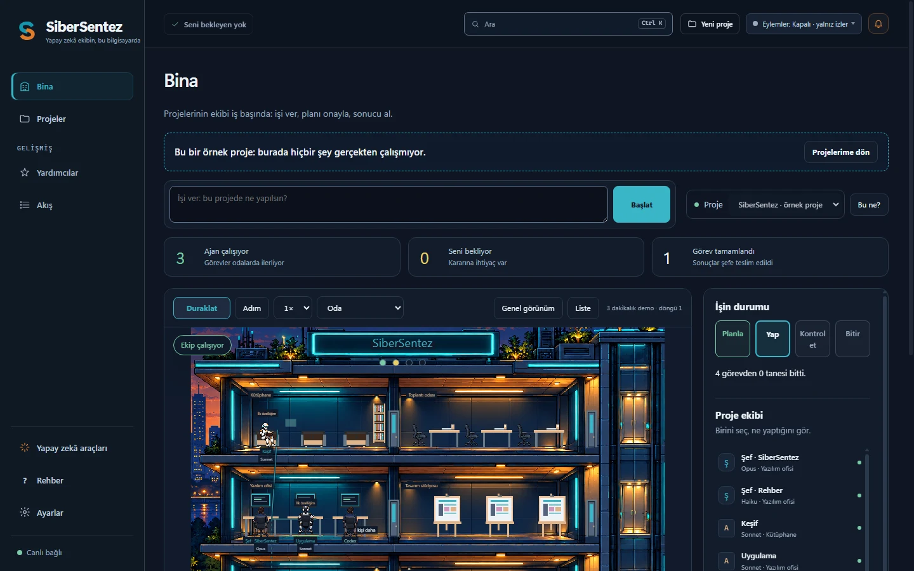
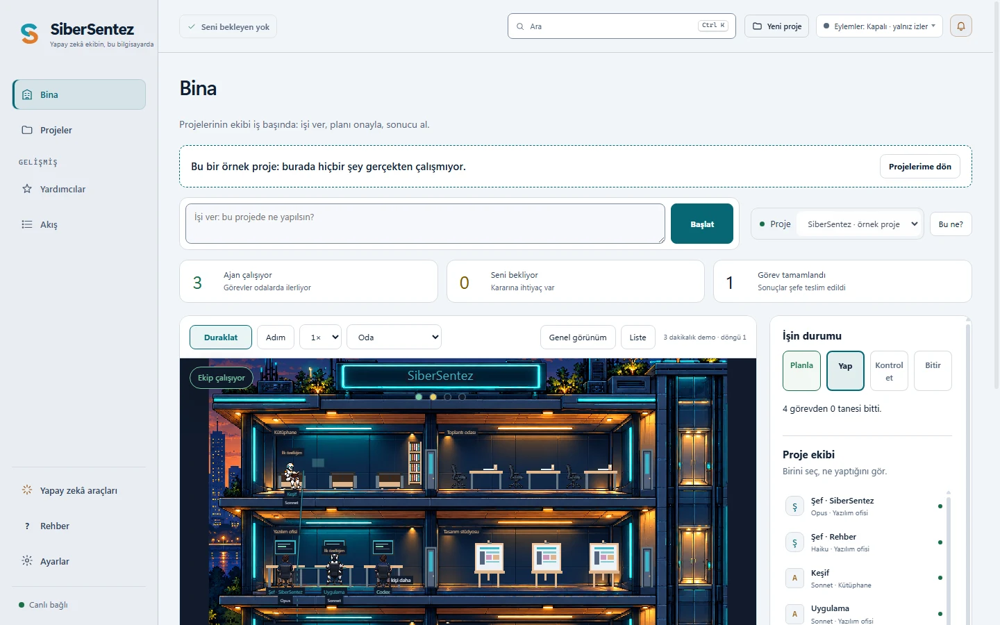

  

<h1 align="center">SiberSentez</h1>

  <b>Kod yazmadan, yapay zekâyla bir şey yap.</b> 
  Zaten sahip olduğun yapay zekâ kodlama aracını senin için hazırlayan, başlatan ve ne yaptığını gösteren 
  ücretsiz ve açık kaynak masaüstü uygulaması: Claude Code, Codex CLI, Gemini CLI, GitHub Copilot CLI, Cursor CLI,
  Qwen Code ve OpenCode.

  
  
  
  

  <a href="https://github.com/VreBey/sibersentez-ai-coding-for-beginners/releases/latest"><b>İndir</b></a> ·
  <a href="https://sibersentez.com/">Web sitesi</a> ·
  <a href="https://sibersentez.com/surum-notlari/">Neler yeni?</a> ·
  <a href="README.md">English</a> ·
  <a href="../../issues/new/choose">Sorun bildir</a>

## İndir

| Bilgisayarın | Dosya | Nasıl |
|---|---|---|
| **Windows 10 / 11** (64 bit) | [`SiberSentez-Setup-<sürüm>.exe`](../../releases/latest) | Çalıştır. Yalnız senin için kurulur, yönetici izni istemez. |
| **Linux** (64 bit, x86_64) | [`SiberSentez-<sürüm>-x86_64.AppImage`](../../releases/latest) | Çalıştırılabilir yap (`chmod +x`) ve aç. Kurulum yok. |

Ücretsiz; hesap ve reklam yok. Kendi hesabıyla bir yapay zekâ kodlama aracı gerekir (ör. Claude Code için bir Claude
aboneliği); SiberSentez onu kurmana yardım eder. Kurulum dosyası henüz kod imzalı değil, bu yüzden Windows ilk seferde
uyarabilir: "Ek bilgi" → "Yine de çalıştır" ([ayrıntı](https://sibersentez.com/#smartscreen)).

## Neden SiberSentez?

Yapay zekâ kodlama araçları güçlüdür ama bir terminalde yaşarlar ve ne isteyeceğini, neyi onaylayacağını, bir hatayı
nasıl geri alacağını bildiğini varsayarlar. SiberSentez onların etrafındaki dost canlısı odadır.

| | Yalnız yapay zekâ aracı | SiberSentez ile |
|---|---|---|
| Başlamak | Git, Node.js ve aracı elle kur | Adım adım sihirbaz; her komutta Enter'a sen basarsın |
| İş vermek | Terminalde iyi bir istem yaz | Kendi sözlerinle söyle; ekip, plan ve kontrol senin için kurulur |
| Dosyalar değişmeden önce | Aracın ayarlarına bağlı | Yapay zekâ önce plan yazar, onayını bekler |
| İşi kontrol etmek | Kodu sen okursun | Ayrı bir denetçi kontrol eder; sonucu tek tıkla açarsın |
| Bir hata | Biliyorsan `git` | Her işten önce kopya alınır: tek tıkla geri dön, onu da geri al |
| Ne olduğunu görmek | Akan terminal çıktısı | Kimin çalıştığını, kimin seni beklediğini ve neyin değiştiğini gösteren bir bina |

Yalnız senin bilgisayarında çalışır, kendi yapay zekâsını getirmez ve işini hiçbir yere göndermez.

## Nasıl çalışır?

1. **Proje oluştur.** Bir ad ver ve ne yapmak istediğini yaz: "arama kutusu olan bir tarif sitesi".
2. **Başlat'a bas.** Yapay zekâ aracın pencerenin içindeki kendi terminalinde, işin ilk mesajıyla açılır.
3. **Planı onayla.** Sen evet demeden hiçbir şeye dokunulmaz; istersen değişiklik iste.
4. **Sonucu aç.** Ayrı bir denetçi kontrol etti. Kabul et, değişiklik iste ya da işten önceki hâle dön.

<table>
  <tr>
    <td width="50%"> <b>Koyu ya da açık.</b> Temanı seç ya da sistemi izle; bina akşam penceresi gibi kalır.</td>
    <td width="50%"> <b>Kontrol edilmiş sonuç.</b> Ayrı bir denetçi işi kontrol eder; sonucu aç, neyin değiştiğine bak ya da geri al.</td>
  </tr>
</table>

## Özellikler

- **Fikirden başla.** Kod bilmen gerekmez; SiberSentez uygun bir başlangıç noktası ve işe yarayan birkaç skill seçer.
- **Küçük bir ekip.** Şef plan yapar, yapan ve kontrol eden ayrı çalışır; Planla → Yap → Kontrol et → Bitir çubuğu
  işin nerede olduğunu gösterir.
- **Her işin geri dönüşü.** Yapay zekâ başlamadan önce projenin kopyası işinin adıyla saklanır.
- **Seni bekleyenleri bil.** Kullanım limiti, oturum kapanması, bağlantı kopması: ne yapacağını söyleyen bir kart çıkar.
- **Paylaşmadan önce tarama.** "İnternete koy", projede parola, anahtar ya da `.env` gibi gizli bilgileri arar.
- **Kurulum kontrolü ve sihirbaz.** Bilgisayardaki araçları bulur, eksiği sade bir dille söyler ve sırayla hazırlatır.
- **Hazır kit.** Yeni başlayanlar için yazılmış 59 skill ve 16 ajan; hiçbiri sen kurmadan etkin olmaz.
- **Türkçe ve İngilizce**, koyu ve açık tema, klavyeyle kullanım, ekran okuyucu için terminal.

Ayrıntılı belgeler (kurulum, eylemler, veri nerede durur, gizlilik, geliştiriciler için) İngilizce README'de:
[README.md](README.md).

## Gizlilik

SiberSentez yalnız `127.0.0.1` üzerinde çalışır. İnternete yalnız iki durumda, ikisi de senin seçiminle çıkar:
GitHub'dan skill getirdiğinde ve Ayarlar'da "Yeni sürüm çıkınca haber ver"i açarsan (kapalı gelir) günde bir kez sürüm
listesine bakmak için. Analiz, reklam ya da izleme yoktur. Kullandığın yapay zekâ aracı yazdıklarını kendi sağlayıcısına
kendi koşullarıyla gönderir.

## Destek ol

**GitHub'da bir yıldız, başka yeni başlayanların SiberSentez'i bulmasına yardım eder.** Kodlamaya yeni başlayan bir
arkadaşına anlatman daha da çok yardım eder. Hata ve fikirler: [Issues](../../issues). Sorular:
**destek@sibersentez.com**. Güvenlik bildirimi: [SECURITY.md](SECURITY.md).

## Lisans

SiberSentez ücretsiz ve açık kaynaklıdır: uygulama **GNU GPL sürüm 3** (ya da sonraki bir sürüm), skill ve ajan kiti
**MIT** lisansıyla ([LICENSE](LICENSE), [kit/LICENSE.md](kit/LICENSE.md)). Yaptığın projeler senindir. "SiberSentez"
adı ve logosu lisansa dahil değildir ([TRADEMARKS.md](TRADEMARKS.md)).
