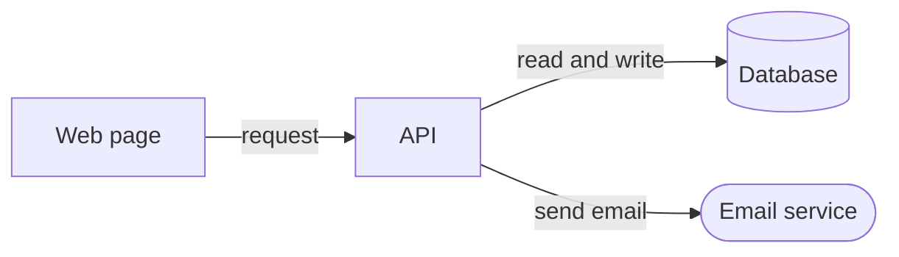

# Architecture notes

A one-page map of how the project fits together, so that a new person (or the user in three months) can find where
things happen and why they are that way. One page: if it grows beyond that, it will not be read or kept true.

## Ground rules

- Talk to the user in their language (Turkish if they write Turkish). Keep commands, code and file names as they are.
- Before each step, say in one plain sentence what you will do and why.
- Ask and wait for a yes before you delete, move or overwrite files, install anything, change system settings, or
  push to a remote.
- Never switch off your tool's permission prompts or safety checks, and never tell the user to.
- Write only what you verified in the files. Mark a guess as a guess, or ask.

## 1. Read before you write

Read `PLAN.md`, the README, the manifest and the top folders. Find the entry points (what starts the program), where
data is saved, where outside services are called, and where the main screens or routes are. If the project is large
and unfamiliar, use `explain-codebase` first and build on its map.

## 2. Ask only what the files cannot say

Two or three questions at most: "Why did you choose X over Y?" for the big choices (database, hosting, framework),
and "What would you tell a newcomer first?". Record the answers as decisions, in the user's words.

## 3. Write `docs/ARCHITECTURE.md`

Keep to about 60 lines, in the user's language:

```markdown
# Architecture

One or two sentences: what this is and who uses it.

## Parts
| Part | Its job | Where |
|---|---|---|
| Web pages | what people see and click | `web/` |
| API | rules and saving data | `api/server.js` |
| Database | the saved data | `data/app.db` |

## How data flows
1. Add a note: the page sends a request -> the API checks it -> saves it -> answers -> the page shows the new note.
2. (One more main action, in the same numbered style.)

## Diagram
(a small diagram, below)

## Decisions
| Date | Decision | Why | Instead of |
|---|---|---|---|

## Limits and open risks
What does not work yet, what would break first with more users.

## Run and test
Where the README explains it.
```

## 4. The diagram

Draw with text boxes, or a Mermaid block (GitHub shows it as a picture). At most ten boxes, arrows labelled with what
travels along them, outside services drawn as a different shape. A diagram nobody can read in ten seconds has too much
in it: remove detail, not accuracy.



## 5. Check it against the files

Open or search every path you wrote; run the run command once if you wrote one. Fix what is wrong. Ask the user
whether a newcomer could answer "where does X happen?" from this page alone. If not, add the missing line.

## 6. Keep it alive

Link it from the README. Suggest: when a part, a flow or a big choice changes, change the page in the same commit.
Date every decision; never delete an old one, add the new one beside it and say what replaced it.

## Do not use for

- A full user guide or install instructions: use `docs-writer`.
- Reference for every route: use `api-docs`.
- Choosing the technology before building: use `tech-stack-chooser`.

## Done when

- `docs/ARCHITECTURE.md` exists, is about one page, and has parts, data flow, a diagram and decisions.
- Every path in it was checked to exist (say how), and guesses are marked.
- The user confirmed that the page answers "where does X happen?" and where it is linked from.
